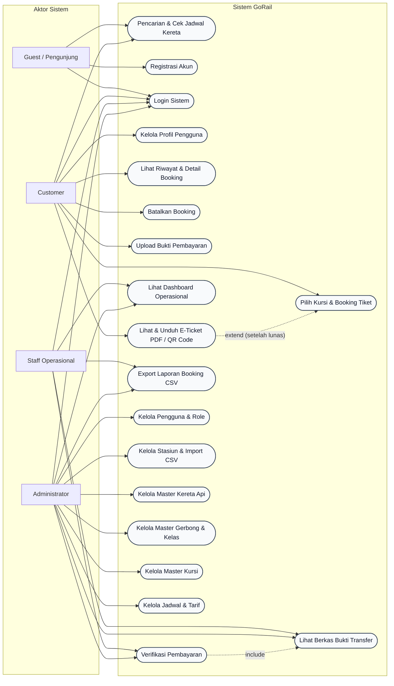

# GoRail — Sistem Reservasi & Manajemen Tiket Kereta Api

GoRail adalah aplikasi web reservasi dan manajemen tiket kereta api berbasis **Laravel 13 + Inertia.js + React.js + MySQL** dengan fitur Role-Based Access Control (RBAC), alur pembayaran manual dengan verifikasi staff, penerbitan e-ticket beserta QR Code dan download PDF, serta manajemen master data untuk administrator.

---

## Diagram Use Case Sistem

Berikut adalah representasi Use Case Diagram sistem GoRail yang mencakup interaksi antara aktor (Guest, Customer, Staff, Admin) dan fungsionalitas sistem:



---

## Fitur Utama Backend

### 1. Role-Based Access Control (RBAC) & Autentikasi
Menggunakan package `spatie/laravel-permission` dengan 3 role:
- **`customer`**: Pencarian jadwal, pemilihan kursi interaktif, booking tiket, upload bukti pembayaran, melihat & mendownload e-ticket.
- **`staff`**: Verifikasi pembayaran (terima/tolak), melihat seluruh booking dan penumpang, export laporan booking ke CSV.
- **`admin`**: Akses penuh mengelola master data (Stasiun, Kereta, Gerbong, Kursi, Jadwal & Tarif), mengelola user/pengguna, dan import massal data stasiun dari file CSV.

### 2. Pencarian Jadwal & Pemilihan Kursi
- Filter pencarian berdasarkan stasiun asal, tujuan, dan tanggal keberangkatan.
- Denah ketersediaan kursi (*seat map*) dinamis per gerbong dengan pengecekan konflik reservasi sebelum transaksi.

### 3. Alur Pembayaran & State Machine
Transisi status hanya dapat dilakukan melalui method model khusus:
- **Status Pembayaran (`StatusPembayaran`)**: `UNPAID` (Belum Bayar) -> `WAITING_VERIFICATION` (Menunggu Verifikasi) -> `PAID` (Lunas) / `REJECTED` (Ditolak).
- **Status Booking (`StatusBooking`)**: `PENDING` (Menunggu) -> `CONFIRMED` (Dikonfirmasi) / `CANCELLED` (Dibatalkan) -> `COMPLETED` (Selesai).
- Saat pembayaran berstatus `PAID`, booking secara otomatis dikonfirmasi (`CONFIRMED`).

### 4. Keamanan Bukti Pembayaran
- File bukti pembayaran disimpan pada storage privat (`storage/app/private/bukti-pembayaran/`).
- Tidak dapat diakses publik secara langsung; diakses melalui route terproteksi dengan validasi otorisasi `PaymentPolicy`.

### 5. E-Ticket, QR Code & Download PDF
- Tiket hanya dapat diterbitkan setelah pembayaran lunas (`PAID`).
- Dilengkapi QR Code unik menggunakan `simplesoftwareio/simple-qrcode`.
- Export tiket ke dokumen PDF siap cetak menggunakan `barryvdh/laravel-dompdf`.

### 6. Fitur Array & Native File I/O (Sesuai Spesifikasi)
- **Export Laporan Booking ke CSV**: Penyusunan data menggunakan array terstruktur dan fungsi native PHP (`fopen`, `fputcsv`, `fclose`).
- **Import Data Stasiun Massal**: Pembacaan file CSV stasiun menggunakan `fopen`, `fgetcsv`, validasi baris, dan batch insert ke database.

---

## Matriks Hak Akses Role (RBAC)

Berikut adalah tabel matriks hak akses untuk setiap fungsionalitas dan fitur dalam sistem:

| Modul / Fitur | Guest | Customer | Staff | Admin | Keterangan / Endpoint |
|---|:---:|:---:|:---:|:---:|---|
| **Eksplorasi & Publik** | | | | | |
| Melihat Halaman Utama & Jadwal Populer | Ya | Ya | Ya | Ya | `GET /` |
| Pencarian & Filter Jadwal Kereta | Ya | Ya | Ya | Ya | `GET /schedules/search` |
| Melihat Detail Jadwal & Denah Kursi | Ya | Ya | Ya | Ya | `GET /schedules/{schedule}` |
| Registrasi Akun Baru | Ya | - | - | - | `GET /register`, `POST /register` |
| Login & Logout Sistem | Ya | Ya | Ya | Ya | `GET /login`, `POST /login`, `POST /logout` |
| **Akun & Profil** | | | | | |
| Dashboard Pengguna | - | Ya | Ya | Ya | `GET /dashboard` |
| Mengubah Profil & Kata Sandi | - | Ya | Ya | Ya | `GET /profile`, `PATCH /profile` |
| Menghapus Akun Pribadi | - | Ya | Ya | Ya | `DELETE /profile` |
| **Reservasi & Tiket (Customer)** | | | | | |
| Pemilihan Kursi & Pembuatan Booking | - | Ya | - | - | `POST /bookings` |
| Melihat Riwayat Booking Pribadi | - | Ya | - | - | `GET /bookings` |
| Melihat Detail Booking Pribadi | - | Ya | - | - | `GET /bookings/{booking}` |
| Membatalkan Booking Pribadi | - | Ya | - | - | `POST /bookings/{booking}/cancel` |
| Mengunggah Bukti Pembayaran | - | Ya | - | - | `POST /payments/{booking}/upload` |
| Melihat E-Ticket & QR Code | - | Ya | - | - | `GET /tickets/{booking}` (status lunas) |
| Mengunduh E-Ticket (PDF) | - | Ya | - | - | `GET /tickets/{booking}/download` |
| **Verifikasi & Operasional (Staff)** | | | | | |
| Melihat Daftar Pembayaran Menunggu Verifikasi | - | - | Ya | Ya | `GET /staff/payments` |
| Mengakses Berkas Bukti Pembayaran Privat | - | - | Ya | Ya | `GET /payments/{payment}/bukti` |
| Verifikasi Pembayaran (Terima / Tolak) | - | - | Ya | Ya | `POST /staff/payments/{payment}/verify` |
| Export Laporan Booking ke File CSV | - | - | Ya | Ya | `GET /reports/bookings/export` |
| **Manajemen Master Data (Admin)** | | | | | |
| Kelola Data Pengguna & Penetapan Role | - | - | - | Ya | `RESOURCE /admin/users` |
| Kelola Master Stasiun | - | - | - | Ya | `RESOURCE /admin/stations` |
| Import Data Stasiun Massal (CSV) | - | - | - | Ya | `POST /admin/stations/import` |
| Kelola Master Kereta Api | - | - | - | Ya | `RESOURCE /admin/trains` |
| Kelola Master Gerbong & Kelas | - | - | - | Ya | `RESOURCE /admin/coaches` |
| Kelola Master Kursi | - | - | - | Ya | `RESOURCE /admin/seats` |
| Kelola Master Jadwal & Tarif Perjalanan | - | - | - | Ya | `RESOURCE /admin/schedules` |

---

## Tech Stack & Library

| Komponen | Teknologi |
|---|---|
| **Framework Backend** | Laravel 13 (PHP 8.3+) |
| **Database** | MySQL |
| **Frontend Adapter** | Inertia.js (React) |
| **RBAC / Hak Akses** | `spatie/laravel-permission` |
| **PDF Generator** | `barryvdh/laravel-dompdf` |
| **QR Code** | `simplesoftwareio/simple-qrcode` |
| **File I/O** | Native PHP Streams (`fgetcsv`, `fputcsv`) |

---

## Struktur Database

```
users
├── roles (Spatie RBAC)
└── bookings (1:N)
    ├── schedule (N:1)
    │   ├── train (N:1) ── coaches (1:N) ── seats (1:N)
    │   ├── station_asal (N:1 -> stations)
    │   └── station_tujuan (N:1 -> stations)
    ├── passengers (1:N)
    ├── booking_seats (1:N -> seats)
    └── payment (1:1)
```

---

## Akun Demo Bawaan (Seeder)

Setelah menjalankan database seeder, tersedia 3 akun default untuk pengujian:

| Role | Email | Password |
|---|---|---|
| **Customer** | `customer@gorail.test` | `password` |
| **Staff** | `staff@gorail.test` | `password` |
| **Admin** | `admin@gorail.test` | `password` |

---

## Panduan Instalasi & Menjalankan Project

### 1. Clone & Setup Environment
```bash
cp .env.example .env
composer install
npm install
php artisan key:generate
```

### 2. Konfigurasi Database pada `.env`
```env
DB_CONNECTION=mysql
DB_HOST=127.0.0.1
DB_PORT=3306
DB_DATABASE=GoRail
DB_USERNAME=root
DB_PASSWORD=
```

### 3. Migrasi & Seed Database
```bash
php artisan migrate:fresh --seed
```

### 4. Jalankan Server Pengembangan
Terminal 1 (Laravel Server):
```bash
php artisan serve
```

Terminal 2 (Vite / React Build):
```bash
npm run dev
```

---

## Ringkasan Route & Endpoint

### Publik / Guest
- `GET /` — Halaman Utama
- `GET /schedules/search` — Pencarian Jadwal Kereta
- `GET /schedules/{schedule}` — Detail Jadwal & Denah Kursi

### Customer (`role:customer`)
- `GET /bookings` — Riwayat Booking
- `POST /bookings` — Pembuatan Booking Baru
- `GET /bookings/{booking}` — Detail Booking
- `POST /bookings/{booking}/cancel` — Pembatalan Booking
- `POST /payments/{booking}/upload` — Upload Bukti Pembayaran
- `GET /tickets/{booking}` — Tampilan E-Ticket
- `GET /tickets/{booking}/download` — Download E-Ticket PDF

### Staff (`role:staff,admin`)
- `GET /staff/payments` — Daftar Pembayaran Menunggu Verifikasi
- `POST /staff/payments/{payment}/verify` — Verifikasi / Tolak Pembayaran
- `GET /reports/bookings/export` — Export Laporan Booking ke CSV

### Admin (`role:admin`)
- `RESOURCE /admin/users` — Manajemen Pengguna & Role
- `RESOURCE /admin/stations` — Manajemen Stasiun
- `POST /admin/stations/import` — Import Massal Stasiun (CSV)
- `RESOURCE /admin/trains` — Manajemen Kereta Api
- `RESOURCE /admin/coaches` — Manajemen Gerbong & Kelas
- `RESOURCE /admin/seats` — Manajemen Kursi
- `RESOURCE /admin/schedules` — Manajemen Jadwal & Tarif Perjalanan

