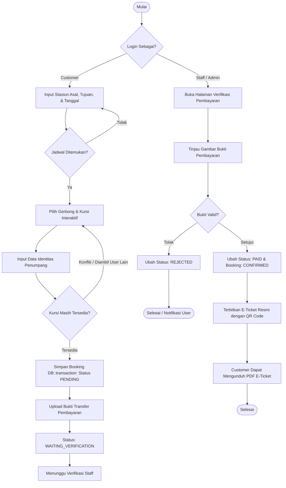

# Laporan Dokumentasi & Analisis Teknis Proyek GoRail
**Sistem Informasi & Reservasi Tiket Kereta Api Berbasis Web**

---

### 1. Rancangan Struktur Data & Diagram Alur Program

#### A. Rancangan Struktur Data (Database Schema & Tipe Data)
Sistem GoRail dirancang menggunakan model data relasional ternormalisasi untuk menjamin integritas data transaksi pemesanan tiket kereta. Berikut adalah entitas, relasi, dan tipe data yang digunakan:

| Nama Entitas / Tabel | Atribut / Kolom | Tipe Data | Keterangan & Batasan |
| :--- | :--- | :--- | :--- |
| **`users`** | `id`<br>`name`<br>`email`<br>`password`<br>`email_verified_at`<br>`timestamps` | `BigInteger` (PK)<br>`String (255)`<br>`String (255)` (Unique)<br>`String (255)`<br>`DateTime` (Nullable)<br>`Timestamp` | Data pengguna sistem (Admin, Staff, Customer). Password dienkripsi dengan Bcrypt/Argon2. |
| **`stations`** | `id`<br>`kode_stasiun`<br>`nama_stasiun`<br>`kota`<br>`timestamps` | `BigInteger` (PK)<br>`String (10)` (Unique)<br>`String (100)`<br>`String (100)`<br>`Timestamp` | Master data stasiun kereta api (Contoh: GMR - Gambir - Jakarta). |
| **`trains`** | `id`<br>`kode_kereta`<br>`nama_kereta`<br>`timestamps` | `BigInteger` (PK)<br>`String (20)` (Unique)<br>`String (100)`<br>`Timestamp` | Master armada kereta (Contoh: KA-AP - Argo Parahyangan). |
| **`coaches`** | `id`<br>`train_id`<br>`nama_gerbong`<br>`kelas`<br>`kapasitas`<br>`timestamps` | `BigInteger` (PK)<br>`BigInteger` (FK ke `trains`)<br>`String (50)`<br>`Enum (KelasGerbong)`<br>`Integer`<br>`Timestamp` | Data gerbong per kereta. Memiliki relasi *one-to-many* dari tabel `trains`. |
| **`seats`** | `id`<br>`coach_id`<br>`nomor_kursi`<br>`timestamps` | `BigInteger` (PK)<br>`BigInteger` (FK ke `coaches`)<br>`String (10)`<br>`Timestamp` | Data kursi pada masing-masing gerbong (Contoh: 1A, 1B, 2A). |
| **`schedules`** | `id`<br>`train_id`<br>`station_asal_id`<br>`station_tujuan_id`<br>`waktu_berangkat`<br>`waktu_tiba`<br>`harga`<br>`kode_jadwal`<br>`timestamps` | `BigInteger` (PK)<br>`BigInteger` (FK ke `trains`)<br>`BigInteger` (FK ke `stations`)<br>`BigInteger` (FK ke `stations`)<br>`DateTime`<br>`DateTime`<br>`Integer`<br>`String (20)` (Unique)<br>`Timestamp` | Jadwal keberangkatan kereta beserta tarif per kursi dan relasi rute stasiun. |
| **`bookings`** | `id`<br>`user_id`<br>`schedule_id`<br>`kode_booking`<br>`tanggal_berangkat`<br>`status`<br>`timestamps` | `BigInteger` (PK)<br>`BigInteger` (FK ke `users`)<br>`BigInteger` (FK ke `schedules`)<br>`String (20)` (Unique)<br>`Date`<br>`Enum (StatusBooking)`<br>`Timestamp` | Transaksi reservasi tiket utama dengan kode acak otomatis unik (Contoh: `GR-A1B2C3D4`). |
| **`passengers`** | `id`<br>`booking_id`<br>`nama_penumpang`<br>`nomor_identitas`<br>`jenis_identitas`<br>`timestamps` | `BigInteger` (PK)<br>`BigInteger` (FK ke `bookings`)<br>`String (150)`<br>`String (50)`<br>`String (20)`<br>`Timestamp` | Manifest penumpang per pesanan (KTP / Paspor / SIM). |
| **`booking_seats`** | `id`<br>`booking_id`<br>`seat_id`<br>`passenger_id`<br>`timestamps` | `BigInteger` (PK)<br>`BigInteger` (FK ke `bookings`)<br>`BigInteger` (FK ke `seats`)<br>`BigInteger` (FK ke `passengers`)<br>`Timestamp` | Pivot pemetaan kursi yang dikunci/dibooking pada jadwal dan tanggal keberangkatan tertentu. |
| **`payments`** | `id`<br>`booking_id`<br>`jumlah`<br>`bukti_pembayaran`<br>`status`<br>`verified_by`<br>`waktu_verifikasi`<br>`timestamps` | `BigInteger` (PK)<br>`BigInteger` (FK ke `bookings`)<br>`Integer`<br>`String (255)` (Nullable)<br>`Enum (StatusPembayaran)`<br>`BigInteger` (FK ke `users`, Nullable)<br>`DateTime` (Nullable)<br>`Timestamp` | Data transaksi dan bukti pembayaran yang diunggah customer untuk diverifikasi oleh petugas. |

---

#### B. Tipe Data Kustom (PHP 8.1+ Enums)
Untuk mencegah *invalid state* dan memudahkan validasi, didefinisikan 3 tipe data kustom:

1. **`KelasGerbong` (`app/Enums/KelasGerbong.php`):**
   - `EKONOMI` = `'ekonomi'`
   - `BISNIS` = `'bisnis'`
   - `EKSEKUTIF` = `'eksekutif'`
2. **`StatusBooking` (`app/Enums/StatusBooking.php`):**
   - `MENUNGGU` = `'PENDING'` (Menunggu pembayaran & verifikasi)
   - `DIKONFIRMASI` = `'CONFIRMED'` (Pembayaran valid & tiket aktif)
   - `DIBATALKAN` = `'CANCELLED'` (Dibatalkan oleh user atau kadaluarsa)
   - `SELESAI` = `'COMPLETED'` (Perjalanan telah selesai)
3. **`StatusPembayaran` (`app/Enums/StatusPembayaran.php`):**
   - `BELUM_BAYAR` = `'UNPAID'`
   - `MENUNGGU_VERIFIKASI` = `'WAITING_VERIFICATION'`
   - `LUNAS` = `'PAID'`
   - `DITOLAK` = `'REJECTED'`

---

#### C. Diagram Alur Program (Flowchart / Activity Diagram)



---

### 2. Fungsi / Metode yang Diperlukan & Modularitas Kode

Proyek ini menerapkan arsitektur **Clean MVC (Model-View-Controller)** dengan pemisahan tanggung jawab (*Separation of Concerns*) yang jelas untuk meningkatkan keterbacaan, kemudahan pengujian (*testability*), dan modularitas kode:

#### A. Controller Layer (Logika Alur Permintaan & Respon)
1. **`ScheduleSearchController`**:
   - `index(Request $request)`: Menangani pencarian jadwal berdasarkan parameter stasiun asal, tujuan, dan tanggal keberangkatan.
   - `show(Schedule $schedule, Request $request)`: Mengambil denah kursi (*seat map*) dinamis dari kereta dan menghitung status ketersediaan kursi secara *real-time*.
2. **`BookingController`**:
   - `index()`: Menampilkan daftar riwayat pesanan tiket milik customer yang sedang login.
   - `store(StoreBookingRequest $request)`: Melakukan validasi data, mengecek ketiadaan bentrok kursi (*race condition checking*), dan menyimpan booking, penumpang, kursi, serta tagihan pembayaran dalam satu blok transaksi database `DB::transaction()`.
   - `show(Booking $booking)`: Menampilkan rincian pesanan dan instruksi pembayaran.
   - `cancel(Booking $booking)`: Membatalkan pesanan jika status masih memungkinkan.
3. **`PaymentController`**:
   - `upload(Request $request, Booking $booking)`: Memvalidasi dan menyimpan file gambar bukti transfer ke storage privat.
   - `verify(Request $request, Payment $payment)`: Digunakan oleh Staff/Admin untuk menyetujui (`PAID`) atau menolak (`REJECTED`) pembayaran.
   - `showBukti(Payment $payment)`: Menyajikan *stream* file gambar bukti transfer secara aman dengan verifikasi policy otorisasi.
4. **`TicketController`**:
   - `show(Booking $booking)`: Menampilkan preview e-ticket resmi dengan QR Code.
   - `download(Booking $booking)`: Mengenerate file PDF e-ticket untuk diunduh customer menggunakan library PDF generator.
5. **`ReportController`**:
   - `eksporLaporanBooking()`: Menghimpun seluruh data transaksi booking dan mengekspornya ke dalam file format CSV (*Spreadsheet*) menggunakan native PHP file stream.
6. **`StationController` / `TrainController` / `CoachController` / `SeatController`**:
   - Modul CRUD master data yang terpisah secara modular pada namespace `App\Http\Controllers\Admin`.
   - `StationController::import(ImportStationRequest $request)`: Membaca file CSV stasiun dan mengimpornya secara massal ke basis data.

#### B. Model Layer & State Machines (Enkapsulasi Logika Bisnis)
Tugas transisi status tidak ditulis berulang-ulang di controller, melainkan dienkapsulasi ke dalam method model:
- `Booking::konfirmasi()`: Mengubah status booking dari `PENDING` menjadi `CONFIRMED`.
- `Booking::batalkan()`: Mengubah status booking menjadi `CANCELLED`.
- `Booking::selesaikan()`: Mengubah status booking menjadi `COMPLETED`.
- `Payment::uploadBukti(string $path)`: Mengubah status pembayaran menjadi `WAITING_VERIFICATION`.
- `Payment::verifikasi(int $staffId)`: Menyetujui pembayaran, mencatat ID staf pemverifikasi, dan memanggil `$booking->konfirmasi()`.
- `Payment::tolak(int $staffId)`: Menolak bukti pembayaran dan mengubah status menjadi `REJECTED`.

---

### 3. Implementasi Kontrol Alur Program (Control Flow)

Kontrol alur program diimplementasikan secara komprehensif pada berbagai lapisan sistem:

#### A. Kontrol Percabangan (*Conditional Logic*)
- **Validasi Kursi Ganda (*Anti-Double Booking*):**
  Pada `BookingController::store()`, sistem mengecek apakah kursi yang dipilih oleh pengguna telah terisi oleh transaksi lain pada tanggal tersebut dengan membandingkan array kursi:
  ```php
  $kursiKonflik = array_intersect($kursiDipilih, $kursiTerbooking);
  if (! empty($kursiKonflik)) {
      return back()->withErrors(['seat_ids' => 'Kursi sudah tidak tersedia.']);
  }
  ```
- **State Transition Guard:**
  Pada model `Booking` dan `Payment`, setiap transisi status dijaga agar tidak terjadi lonpatan status yang tidak valid:
  ```php
  public function konfirmasi(): bool {
      if ($this->status !== StatusBooking::MENUNGGU) {
          return false;
      }
      $this->status = StatusBooking::DIKONFIRMASI;
      return $this->save();
  }
  ```

#### B. Kontrol Hak Akses & Otorisasi (*Middleware & Policies*)
- **Role-Based Access Control:** Menggunakan Spatie Permission pada `routes/web.php`:
  - `middleware(['auth', 'role:customer'])` untuk pemesanan tiket, upload bukti, dan unduh tiket.
  - `middleware(['auth', 'role:staff,admin'])` untuk verifikasi pembayaran dan ekspor laporan CSV.
  - `middleware(['auth', 'role:admin'])` untuk pengelolaan master stasiun, armada kereta, dan manajemen akun.
- **Policy Authorization:** Menggunakan `Gate::authorize('view', $booking)` untuk memastikan customer hanya dapat melihat dan mengunduh tiket miliknya sendiri.

#### C. Kontrol Transaksi Database (*Database Transactions*)
- Menggunakan `DB::transaction(function() { ... })` saat proses booking tiket. Apabila salah satu proses gagal (misal gagal membuat record penumpang atau kursi), seluruh operasi database akan di-*rollback* secara otomatis sehingga tidak menyisakan data sampah (*orphaned data*).

---

### 4. Implementasi Penggunaan Array dan Akses File

#### A. Implementasi Penggunaan Array
Array digunakan secara intensif dalam pemrosesan data, validasi, dan transformasi:

1. **Manipulasi Kursi & Deteksi Konflik (`BookingController.php` & `ScheduleSearchController.php`):**
   - Mengambil data kursi terisi ke dalam flat array menggunakan `pluck('seat_id')->toArray()`.
   - Menggunakan `array_intersect()` untuk mendeteksi tumpang tindih antara kursi yang diminta dengan kursi yang sudah terpesan.
   - Menyusun array bersarang (*nested array*) denah kursi per gerbong:
     ```php
     $denahKursi[] = [
         'gerbong' => $gerbong->nama_gerbong,
         'kelas' => $gerbong->kelas->value,
         'kursi' => $kursiPerGerbong,
     ];
     ```
2. **Bulk Insert Data Penumpang & Stasiun:**
   - Menyusun array asosiatif untuk iterasi pembuatan manifest penumpang.
   - Menampung ribuan baris CSV ke dalam array `$daftarStasiunBaru[]` sebelum di-*insert* massal menggunakan `Station::insert($daftarStasiunBaru)`.
3. **Data Seeder Idempoten (`UserSeeder.php`):**
   - Menggunakan array daftar akun per role untuk menginisialisasi kredensial pengguna tanpa duplikasi hash.

#### B. Implementasi Akses File (File I/O)

1. **Akses & Penyimpanan Bukti Pembayaran (`PaymentController.php`):**
   - Mengunggah file gambar (JPEG, PNG, JPG) ke direktori privat menggunakan `Storage::disk('local')->put('bukti-pembayaran', $file)`.
   - Menghapus file bukti lama secara otomatis saat user mengunggah ulang bukti baru (`Storage::disk('local')->delete()`).
   - Menyajikan file secara aman menggunakan `Storage::disk('local')->response($path)` setelah melalui pengecekan hak akses (*Gate*).

2. **Ekspor Laporan Transaksi Booking ke File CSV (`ReportController.php`):**
   - Menggunakan native PHP File I/O (`fopen`, `fputcsv`, `fclose`) untuk menulis data baris per baris ke file fisik CSV di server:
     ```php
     $handleFile = fopen($lokasiFile, 'w');
     foreach ($baris as $satuBaris) {
         fputcsv($handleFile, $satuBaris);
     }
     fclose($handleFile);
     return response()->download($lokasiFile)->deleteFileAfterSend(true);
     ```

3. **Impor Massal Data Stasiun dari File CSV (`StationController.php`):**
   - Membaca file CSV yang diunggah admin baris demi baris menggunakan `fopen($fileCsv->getRealPath(), 'r')` dan `fgetcsv($handleFile, 1000, ',')`.
   - Memfilter header dan mengabaikan kode stasiun duplikat sebelum dimasukkan ke database.

4. **Penerbitan & Unduh E-Ticket Format PDF (`TicketController.php`):**
   - Merender template tiket HTML/Blade lengkap dengan QR Code menjadi file PDF dinamis yang dapat disimpan dan dicetak penumpang untuk keperluan boarding.